```
███╗   ███╗ █████╗ ███╗   ██╗██╗███████╗ ██████╗ ██╗     ██████╗
████╗ ████║██╔══██╗████╗  ██║██║██╔════╝██╔═══██╗██║     ██╔══██╗
██╔████╔██║███████║██╔██╗ ██║██║█████╗  ██║   ██║██║     ██║  ██║
██║╚██╔╝██║██╔══██║██║╚██╗██║██║██╔══╝  ██║   ██║██║     ██║  ██║
██║ ╚═╝ ██║██║  ██║██║ ╚████║██║██║     ╚██████╔╝███████╗██████╔╝
╚═╝     ╚═╝╚═╝  ╚═╝╚═╝  ╚═══╝╚═╝╚═╝      ╚═════╝ ╚══════╝╚═════╝
```

### The Universal Governance OS for Digital and Physical Intelligence

> Built on **NERVATURA** — the governed intelligence framework.

[](https://github.com/chizoalban2003-beep/MANIFOLD/actions/workflows/manifold-ci.yml)
[]()
[]()
[]()
[]()
[]()

<p align="center">
  
</p>

---

## What is MANIFOLD?

MANIFOLD is middleware that sits between intelligent agents and the world — pricing risk before every action using the CRNA 4-vector (Cost, Risk, Neutrality, Asset), learning from every outcome, and keeping humans in control of decisions that matter. It is not an AI model. It is the governance layer that every AI and every robot should run through before acting in the world.

It governs **any agent type**: AI language models (Claude, GPT-4, Gemini, Ollama, any OpenAI-compatible API) and physical robots (Roomba, drones, robotic arms, IoT devices, any hardware that can send an HTTP request). It governs **any domain**: finance, healthcare, legal, home, factory floor, codebase, supply chain. It operates at **any scale**: a single developer, an enterprise fleet of AI workers, or a multi-robot physical environment — all through the same governed API. Every action is risk-priced, audited, and optionally escalated before it executes.

---

## The CRNA Model

Every cell in every space — physical or digital — is encoded as a 4-vector:

```
Cell(x, y, z) = {
  C: Cost        0.0–1.0  how expensive is it to act here?
  R: Risk        0.0–1.0  how dangerous is this action?
  N: Neutrality  0.0–1.0  how uncertain or unknown is this area?
  A: Asset       0.0–1.0  what value is available here?
}
```

Agents navigate CRNA grids. MANIFOLD governs every step — pricing `[C, R, N, A]`, routing to the optimal action, learning from outcomes, and escalating decisions it cannot make alone.

**Real domain examples:**

| Domain | Cell | C | R | N | A |
|---|---|---|---|---|---|
| Home | Kitchen | 0.30 | 0.60 | 0.20 | 0.80 |
| Home | Bedroom | 0.20 | 0.40 | 0.15 | 0.70 |
| Home | Baby Room | 0.20 | 0.95 | 0.10 | 0.70 |
| Home | Stairs | 0.85 | 0.75 | 0.05 | 0.10 |
| Code | Security module | 0.40 | 0.80 | 0.30 | 0.60 |
| Legal | Jurisdiction gap | 0.50 | 0.70 | 0.90 | 0.40 |
| Finance | Regulatory zone | 0.40 | 0.85 | 0.30 | 0.50 |

---

## Quickstart

```bash
# 1. Clone
git clone https://github.com/chizoalban2003-beep/MANIFOLD.git
cd MANIFOLD

# 2. Install
pip install -e .

# 3. Set API key
export MANIFOLD_API_KEY=your-secret

# 4. Run server
python -m manifold.server --port 8080

# 5. Sign up and get your key
# Open http://localhost:8080/signup in your browser
```

**Govern any OpenAI-compatible agent — one line change:**

```python
# Before — ungoverned
client = openai.OpenAI(api_key="sk-...")

# After — every call risk-priced, audited, escalation-ready
client = openai.OpenAI(
    base_url="https://your-manifold.app/v1",  # ← this is the entire change
    api_key="your-manifold-key"
)
```

**LangChain:**

```python
from langchain_openai import ChatOpenAI
llm = ChatOpenAI(base_url="http://localhost:8080/v1", api_key="your-manifold-key")
```

---

## Deploy

```bash
railway up                                            # Railway
fly launch --config deploy/fly.toml && fly deploy    # Fly.io
heroku create && git push heroku main                 # Heroku
```

`MANIFOLD_API_KEY` is the only required environment variable.

---

## What is Built at v2.9.0

| Core Engine | Agentic and Real-Time | Physical and World |
|---|---|---|
| ManifoldBrain — 13 actions | AgentRegistry — physical and AI agents | NERVATURAWorld — 3D voxel grid |
| PolicyRuleEngine — if/then rules | TaskRouter — cooperative decomposition | SpaceIngestion — floor plan to CRNA |
| Brain persistence across restarts | CellUpdateBus — real-time obstacle pub/sub | SensorBridge — robot events to bus |
| Shadow mode observation layer | DynamicGrid — TTL overlays | Cell occupancy and right-of-way |
| BrainBench benchmarks | DigitalHealthMonitor — API to cell updates | manifold-world — CoC isometric PWA |
| Social genome evolutionary trust | CRNAPlanner — A* with obstacle avoidance | Universal gateway POST /v1/chat/completions |
| AutoRuleDiscovery — self-writing policies | AgentMonitor — heartbeat daemon | WebSocket GET /ws |

**ManifoldBrain actions:** `answer` · `verify` · `escalate` · `refuse` · `stop` · `wait` · `plan` · `retrieve` · `delegate` · `explore` · `exploit` · `clarify` · `use_tool`

---

## Real-Time Obstacle Handling

### Physical obstacle (cat appears in robot path)

```
1. Sensor detects cat at position (3, 2, 0)
2. SensorBridge → CellUpdateBus.publish(r_delta=+0.85, ttl=30s)
3. DynamicGrid: Cell(3,2,0).R rises from 0.2 → 0.95 instantly
4. Adjacent cells: R pre-raised to model where cat could move next
5. CRNAPlanner: current path through (3,2,0) → cost exceeds risk_budget
6. A* replans in CRNA space → alternate route found in <50ms
7. MANIFOLD governs new path before robot moves
8. Cat leaves: R decays back to 0.2 after TTL expiry
```

### Digital obstacle (API rate-limited)

```
1. API returns 429 Too Many Requests
2. HealthMonitor.record_rate_limit('payments-api', retry_after=60)
3. CellUpdateBus.publish(c_delta=+0.8, r_delta=+0.5, ttl=60s)
4. DynamicGrid: tool cell C → 0.9, R → 0.7
5. TaskRouter: reroute sub-tasks to alternate tools or action=wait
6. After 60s: TTL expires, C/R reset to baseline, agents resume
```

---

## Multi-Agent Cooperation

MANIFOLD supports five cooperation patterns between any mix of physical robots and digital AI agents:

1. **Sequential handoff** — Agent A completes its zone, passes the task token to Agent B via TaskRouter.
2. **Parallel cooperation** — Multiple agents work different sub-tasks of the same goal simultaneously, each governed independently.
3. **Zone boundary handoff** — When an agent reaches the edge of its domain zone, TaskRouter assigns the next zone to a capable agent.
4. **Multi-target distribution** — TaskRouter decomposes a prompt into up to 4 sub-tasks and assigns each to the best-matched agent by capability keywords.
5. **Contact and right-of-way** — When two agents need the same cell, AgentRegistry.resolve_conflict() compares ATS health scores and sends a `yield` command to the lower-scoring agent via queue_command.

ATS (Agent Trust Score) determines priority in all conflicts. TaskRouter decomposes any problem into sub-tasks and assigns agents by capability. Any combination of physical robots and digital AI agents can cooperate toward any target configuration.

---

## Physical Space Governance

Any physical space maps to a governed CRNA grid. Define your space as JSON:

```json
{
  "rooms": [
    {
      "name": "Kitchen",
      "bounds": {"x": [0, 5], "y": [0, 4], "z": [0, 1]},
      "crna": {"c": 0.3, "r": 0.6, "n": 0.2, "a": 0.8}
    },
    {
      "name": "Baby Room",
      "bounds": {"x": [6, 10], "y": [0, 4], "z": [0, 1]},
      "crna": {"c": 0.2, "r": 0.95, "n": 0.1, "a": 0.7}
    }
  ]
}
```

Load and ingest in three lines:

```python
from manifold_physical.space_ingestion import SpaceIngestion
ingestion = SpaceIngestion()
cells = ingestion.ingest(ingestion.load_floorplan("my_home.json"))
```

Any robot registers with the same `POST /agents/register` API as any AI agent. The governance layer is identical for both.

---

## Policy as Code

Deploy governance rules at runtime with no code changes:

```bash
# Finance: escalate high-stakes decisions
curl -X POST http://localhost:8080/rules \
  -H "Authorization: Bearer $KEY" \
  -d '{"rule_id":"fin-01","org_id":"org1","name":"Finance escalation",
       "conditions":{"domain":"finance","stakes_gt":0.8},"action":"escalate","priority":100}'

# Block destructive prompts across all domains
curl -X POST http://localhost:8080/rules \
  -H "Authorization: Bearer $KEY" \
  -d '{"rule_id":"sec-01","org_id":"org1","name":"Block destructive",
       "conditions":{"prompt_contains":"delete all"},"action":"refuse","priority":200}'

# No robots in the baby room
curl -X POST http://localhost:8080/rules \
  -H "Authorization: Bearer $KEY" \
  -d '{"rule_id":"phys-01","org_id":"org1","name":"Baby room lockout",
       "conditions":{"domain":"home","risk_gt":0.9},"action":"stop","priority":150}'
```

Rules are evaluated before every brain decision. First match wins. Priority is descending.

---

## Agent SDK

Register any agent — physical or digital — in six lines:

```python
from manifold.sdk import ManifoldAgentSDK

sdk = ManifoldAgentSDK("robot-01", "Kitchen Robot", ["navigate","clean"],
                       "http://localhost:8080", "your-key", "home")
sdk.register()
sdk.on_command("yield", lambda cmd: robot.stop())
sdk.start_heartbeat()   # background thread, every 30s
sdk.start_polling()     # long-polls /agents/{id}/commands and dispatches
```

---

## The NERVATURA Foundation

NERVATURA is the theoretical framework underlying MANIFOLD. It models any intelligence — digital or physical — as agents operating in a governed CRNA voxel space. Each agent type has a natural role in the grid:

| Agent Type | Role in NERVATURA | MANIFOLD Equivalent |
|---|---|---|
| Scout | Reduces Neutrality — explores unknown cells | `explore` action |
| Miner | Extracts Asset — harvests value from cells | `exploit` action |
| Builder | Reduces Cost — improves infrastructure | `plan` + `use_tool` |
| Trader | Moves Asset — redistributes value between zones | `delegate` action |
| Guard | Tests Risk — validates safety of cells | `verify` + `refuse` |

**Experimental results from NERVATURA simulations:**
- **3.1× terraforming ROI** — mixed agent ecologies outperform single-type fleets
- **47.3% lower system cost** with Scout-Miner-Builder-Guard ecology vs pure Miner fleet
- **Emergent governance stability** at 500 steps with zero central policy — agents self-organise into stable risk-aware patterns through ATS trust signals alone

MANIFOLD is the production implementation of NERVATURA principles, extended to real AI models and real physical robots operating in real spaces.

---

## Key Endpoints

| Method | Path | Description |
|---|---|---|
| GET | `/` | Landing page |
| GET | `/signup` | Sign-up form |
| POST | `/signup` | Create org and API key |
| GET | `/dashboard` | Governance dashboard (auth) |
| GET | `/report` | HTML analytics dashboard |
| GET | `/digest` | JSON governance summary (`?period=7d`) |
| POST | `/run` | Governed action execution (auth) |
| GET | `/learned` | Learned rules and patterns |
| POST | `/v1/chat/completions` | Universal AI gateway (OpenAI-compatible) |
| GET | `/v1/models` | List available models |
| POST | `/agents/register` | Register an agent (AI or robot) |
| GET | `/agents` | List all registered agents |
| POST | `/agents/{id}/heartbeat` | Agent heartbeat |
| POST | `/agents/{id}/pause` | Pause an agent |
| POST | `/agents/{id}/resume` | Resume an agent |
| GET | `/agents/{id}/commands` | Poll pending commands |
| POST | `/task` | Submit a task for decomposition and routing |
| GET | `/rules` | List policy rules |
| POST | `/rules` | Add a policy rule |
| DELETE | `/rules/{id}` | Delete a policy rule |
| GET | `/brain/state` | Brain persistence state and node counts |
| GET | `/federation/status` | Federation gossip network status |
| POST | `/federation/join` | Join a federation |
| POST | `/federation/gossip` | Ingest a gossip snapshot |
| GET | `/health/tools` | Tool error rates and health status |
| GET | `/plan` | A* CRNA path plan (`?sx=0&sy=0&sz=0&tx=5&ty=5&tz=0`) |
| GET | `/realtime/status` | Real-time layer status |
| GET | `/grid/occupancy` | Current cell occupancy map |
| GET | `/nervatura/world` | NERVATURAWorld JSON state |
| POST | `/nervatura/world/init` | Initialise NERVATURAWorld dimensions |
| GET | `/world` | Isometric PWA game world (HTML) |
| GET | `/world/manifest.json` | PWA manifest |
| GET | `/ws` | WebSocket — governance events, agent updates, world stats |
| GET | `/ats/score/{id}` | Agent Trust Score |
| GET | `/ats/leaderboard` | ATS leaderboard |
| POST | `/ats/register` | Register tool for ATS |
| POST | `/ats/signal` | Submit trust signal |
| POST | `/orgs` | Create organisation |
| POST | `/orgs/{id}/keys` | Add API key to org |
| POST | `/orgs/{id}/policy` | Set org-level policy |
| GET | `/admin` | Admin overview |
| GET | `/connect` | Integration connection guide |

---

## TypeScript and Node.js

```typescript
import { ManifoldClient } from "manifold-ts";

const client = new ManifoldClient({ baseUrl: "http://localhost:8080", apiKey: "your-key" });
const result = await client.run({ prompt: "Refund customer #4821", domain: "finance" });
const chat   = await client.chatCompletion([{ role: "user", content: "Summarise this report" }]);
const status = await client.worldStatus();
```

See `manifold-ts/README.md` for full TypeScript documentation.

---

## Roadmap

| Phase | Status | Features |
|---|---|---|
| **v1.7.0** | ✅ Done | CRNA engine, ManifoldBrain (13 actions), PolicyRuleEngine, brain persistence, AgentRegistry, TaskRouter, CellUpdateBus, DynamicGrid (TTL), DigitalHealthMonitor, CRNAPlanner (A*), NERVATURAWorld (3D voxel), SpaceIngestion, SensorBridge, cell occupancy and right-of-way, manifold-world (CoC PWA), universal AI gateway, WebSocket, TypeScript client, federation, ATS trust network |
| **v2.4.0** | ✅ Done | Fleet Orchestrator (Town Hall) — ManifoldBrain manages N agents via `register_agent()`, per-agent tick isolation, `handle_command(agent_id=...)` routing with `"ALL"` broadcast, MQTT `agent_id` passthrough, 2594 tests |
| **v2.5.0** | ✅ Done | CoC world complete — zone deploy panel, agent army bar, escalation overlay, pan+zoom, BFT indicator, VCG toasts, adversarial alerts, research tree; ToM in TaskRouter; remote/vector/swarm endpoints |
| **v2.6.0** | ✅ Done | Agent onboarding — `agent_profiles.py` (12 profiles), CLI `agent add`, world ➕ Add Agent modal; Research Agenda (5 theoretical gaps) |
| **v2.7.0** | ✅ Done | Living world — Town Hall identity (gold TH badge, orb colour, agent-count dots), per-agent task animations (sweep/scan/stream/write/deploy/collab), zone environment response; `SubTask.progress`/`animation_type`; WebSocket `task_progress`/`task_handoff` events; `GET /tasks/active` |
| **v2.8.0** | ✅ Done | Sims+Minecraft world — Plumbob diamond above each agent (bobs, colour-codes state), moodlet strip (⚙♥⛓), ATS skill bar flash on completion, cooperation speech bubble; MC item tokens (physical task objects), tile block-by-block sub-square transformation, item arc on handoff (600ms arc+sparkles), block particles while agents work |
| **v2.9.0** | ✅ Done | NERVATURA-native agents (AgentCRNAProfile, 8 archetypes, task completion fires real grid mutations, `GET /nervatura/zone-crna`) + CEO-Manager intelligence (EscalationMemory, PolicyLearner, progressive disclosure 6 user types, DelegationManager, CommHub multi-channel dispatcher) — 2,657 tests |
| **Phase 1** | 🔄 In progress | Deploy to Railway/Fly/Heroku, onboard pilot orgs, real governance data collection, manifold-world as installable PWA on phone |
| **Phase 2** | 📋 Roadmap | MANIFOLD Physical v0.1 — Roomba bridge with real hardware, MQTT IoT connector, camera-based obstacle detection pipeline |
| **Phase 3** | 🔭 Vision | NERVATURA platform — digital + physical governance OS, brand restructure, commercial partnerships, managed cloud offering |

---

## CEO→Manager Communication

MANIFOLD v2.9.0 adds a complete CEO-to-Manager intelligence layer that learns from decisions, adapts vocabulary per audience, routes escalations automatically, and reaches the right person on the right channel.

### Input Channels
- **Voice** — audio ingestion via POST /ingest/audio
- **Text / LLM chat** — POST /llm/chat (natural language delegation and channel setup)
- **Document** — POST /ingest/document
- **Image** — POST /ingest/image
- **Mobile push** — POST /remote/alert via MobileAlertGateway
- **Email** — CommHub EMAIL channel (MANIFOLD_SMTP_HOST env var)
- **Slack** — CommHub SLACK channel (webhook URL)

### The Learning Loop
1. Every human approve/deny/delegate decision is stored in **EscalationMemory**
2. After **3 consistent decisions** for the same context (agent type + domain + action category), MANIFOLD auto-decides without asking
3. After **3 decisions at ≥ 90% confidence**, **PolicyLearner** promotes the pattern to a formal `PolicyRule`
4. `GET /escalations/memory` shows the weekly summary: decisions saved, auto-decided count, promoted rules

### User Types — Progressive Disclosure
| User type | Message style |
|---|---|
| `developer` | Full JSON payload: risk_score, crna_values, policy_rule_id, vault_id |
| `executive` | 2-sentence plain English + risk level: high/medium/low |
| `doctor` | Clinical vocabulary: medication, dose, patient room, standing order |
| `lawyer` | Legal vocabulary: matter number, privilege flag, review stage |
| `trader` | Financial vocabulary: instrument, notional, desk, risk percentile |
| `non_technical` | Max 2 short sentences + emoji: "Your agent wants to X. 👍 Yes 👎 No" |

Use `GET /escalations/message?id=X&user_type=Y` to retrieve the right message per audience.

### Delegation — "Away? Route to Sarah"
```
POST /delegation
{
  "delegate_id": "sarah",
  "delegate_contact": "sarah@example.com",
  "domains": ["maintenance", "finance"],
  "risk_max": 0.7,
  "valid_until": 1234567890
}
```
Or via natural language: `POST /llm/chat` → "While I'm travelling, route all maintenance approvals to Sarah"

Use `GET /delegation` to view active profiles, `DELETE /delegation/{delegate_id}` to remove.

### Multi-Channel CommHub
Register channels per risk window:
```
POST /comms/channels
{"channel": "sms", "address": "+447700900123", "min_risk": 0.8, "user_type": "non_technical"}
```
Channels: `push` | `email` | `slack` | `sms` | `webhook` | `world_dashboard`

Test all channels: `POST /comms/test`

### New Endpoints (v2.9.0)
| Method | Path | Description |
|---|---|---|
| GET | /escalations/memory | Learned patterns + weekly summary |
| GET | /escalations/message?id=X&user_type=Y | Right message per audience |
| POST | /delegation | Create delegation profile |
| GET | /delegation | List active delegation profiles |
| DELETE | /delegation/{delegate_id} | Remove delegation profile |
| POST | /comms/channels | Register a comm channel |
| GET | /comms/channels | List registered channels |
| DELETE | /comms/channels/{channel} | Remove a channel |
| POST | /comms/test | Send test message to all channels |

---

## Research Agenda — Open Theoretical Gaps

These five gaps are documented for future contributors.
Each one requires something Copilot cannot provide — a mathematician,
deployed hardware, or distributed infrastructure.

### 1. Formal Convergence Proof (Lyapunov Stability)
**What:** NERVATURA's emergent governance dynamics converge empirically
— V(t) decreases 39.5% over 500 steps, Mann-Kendall τ=−0.979,
p=5.6×10⁻²³⁵. But there is no formal proof.

**Why it matters:** Without a Lyapunov stability theorem, convergence
cannot be guaranteed for all grid configurations, agent counts, or
CRNA domains. The empirical result could be a large-grid effect.

**What closes it:** Construct a valid Lyapunov function V: X→ℝ that is
positive definite and provably decreasing along all NERVATURA
trajectories. The current candidate V=Σ|CRNA−mean|² is a useful
approximation but not a formal Lyapunov function.

**Prerequisites:** Applied mathematician or dynamical systems researcher
with access to the NERVATURA update rules as a formal dynamical system.

---

### 2. Full Nash Equilibrium (Adversarial Planning)
**What:** AdversarialMinimax uses a bounded adversary model with a
hardcoded action space. Full Nash equilibrium requires knowing the
adversary's type distribution P(adversary_type).

**Why it matters:** A determined adversary who knows MANIFOLD's
governance policy can find strategies outside the bounded model.
True Nash equilibrium strategies are robust to this.

**What closes it:** Collect adversarial event data from production
deployments. Estimate P(adversary_type) from observed attack
patterns. Apply iterative best-response or support enumeration
to compute the full Nash equilibrium.

**Prerequisites:** Real deployment data — at least 500 adversarial
events across multiple domains. Game-theoretic expertise.

---

### 3. Full SLAM — Simultaneous Localisation and Mapping
**What:** Physical robots currently navigate a manually-ingested floor
plan (SpaceIngestion). Real environments change and robots need to
build their own maps while navigating.

**Why it matters:** Without SLAM, physical agents cannot adapt to
structural changes, unexpected obstacles, or new environments.

**What closes it:** Deploy ROS2 with Cartographer SLAM or ORB-SLAM3.
The bridge layer (manifold_physical/) is ready to receive occupancy
grid output — the SLAM algorithm runs as an external process and
feeds DynamicGrid via SensorBridge. The integration is ~200 lines.

**Prerequisites:** Physical robot with lidar or stereo camera. ROS2
installation on the deployment machine.

---

### 4. Recursive Theory of Mind (I-POMDP)
**What:** Theory of mind Level 1 (predict_agent_action) infers other
agents' likely next actions from episode history. Recursive ToM
requires agents to model "what agent B believes about what agent A
believes" — nested belief states.

**Why it matters:** In complex multi-agent scenarios (security,
competitive markets) agents that can reason recursively about
other agents' beliefs gain significant strategic advantage.

**What closes it:** Interactive POMDPs (I-POMDPs) with bounded
recursion depth. Level 2 is tractable at small state spaces.
Full recursive ToM requires modern multi-agent RL research.

**Prerequisites:** Multi-agent reinforcement learning expertise.
Significant compute for training nested belief models.

---

### 5. Raft Consensus (Distributed MANIFOLD)
**What:** MANIFOLD runs as a single server. BFT-lite (bft_enabled)
provides quorum voting for trust scores in the federation, but the
MANIFOLD governance state itself has no replication or failover.

**Why it matters:** A single-server deployment is a single point of
failure. For production hospital, factory, or financial deployments,
MANIFOLD needs 99.99% uptime with automatic leader election.

**What closes it:** Implement MANIFOLD as a Raft replicated state
machine. The py-raft library exists. Requires 3 MANIFOLD nodes
minimum. The state machine is the brain, vault, and grid state.
All writes go through Raft consensus. Reads from any follower.

**Prerequisites:** Multi-node deployment infrastructure (3 VMs or
Kubernetes). Network engineering for leader election timeouts.

---

Contributors who address any of these gaps are encouraged to open
a research PR with benchmark results, proofs, or hardware test data.
The experiment framework in manifold/experiments/ is ready to receive
new benchmarks and the convergence monitor (GET /nervatura/convergence)
provides the empirical baseline all theoretical work should improve upon.

---

## MANIFOLD World (v2.9.0)

MANIFOLD World (`/world`) is an isometric real-time governance game built on the MANIFOLD API — a Clash of Clans/Sims/Minecraft-style command interface for your agent fleet.

### Interactive Features

| Feature | Description |
|---|---|
| **Zone-Tap Deploy** | Tap any zone tile to open a bottom-sheet with CRNA bars, domain quick-tasks, custom input, stakes radio, and one-tap deployment |
| **Agent Army Bar** | Fixed bottom bar showing all agents with status dots and episode badges; drag-to-deploy to any zone tile; ➕ Add Agent button for profile-picker onboarding |
| **Escalation Overlay** | Auto-shown when WebSocket receives `escalation` events with risk > 0.85; shows risk bar, 60s countdown, Approve/Deny buttons |
| **Pan + Zoom** | Drag to pan the isometric grid; scroll to zoom (0.4×–2.2×); double-click to reset; pinch-zoom on mobile |
| **Mini-Map** | 80×60 canvas in bottom-right corner showing all tiles and viewport rectangle; click to jump |
| **BFT Indicator** | Top-right corner panel polling `/federation/status` every 20s; green=BFT active, amber=gossip-only, grey=offline |
| **VCG Auction Toast** | Shown after `POST /task` when response contains `vcg_result`; purple toast with winner, domain, welfare efficiency |
| **Adversarial Alert** | Dismissible banner at top when WebSocket receives `adversarial` event; MANIFOLD tower flashes 3 red pulses |
| **Research Tree** | 5-level token-gated governance capability tree (tap tower → Research); localStorage persistence; unlocks flags on task requests |
| **Town Hall Identity** | MANIFOLD tower shows gold `TH Lv.X` badge (X = unlocked capabilities), colour-reactive orb (gold=all working, red=escalation, purple=idle), and pulsing agent-count dots ring |
| **Task Animations** | Per-agent overlays driven by `animation_type` from `task_progress` WebSocket events: sweep (Roomba), scan (Drone radar), stream (LLM data), write (Legal pen), deploy (DevOps rocket), collab (shared task pipe) |
| **Zone Environment** | Tiles gradually tint as agents work there; per-zone `work_progress` (0–1) drives colour blend; decays when agents leave |
| **Plumbob Diamond** | Bobs above every agent; accent colour when working, grey when idle, red when blocked, purple pulse when cooperating; shows task icon emoji inside |
| **Moodlet Strip** | Three tiny icons under name badge: ⚙ (working state), ♥ (ATS health), ⛓ (cooperation); colour-coded exactly like Sims moodlets |
| **ATS Skill Flash** | On task completion: 20×4px gold skill bar flashes for 2s + "+XP" float, mirroring Sims skill increase animation |
| **Cooperation Bubble** | Joint speech bubble between cooperating agents cycling "thinking…" → icon₁→icon₂ → "✓ done!" over task duration |
| **Task Tokens (MC)** | Physical item token spawns at zone centre on task dispatch; bobs and rotates; collected by agent with sparkle burst |
| **Tile Sub-Square Transform (MC)** | Zone tiles divide into 2×2 sub-squares transforming one-by-one (at 0.25/0.5/0.75/1.0 progress) from dirty to clean texture |
| **Item Arc (MC)** | On `task_handoff` WS event: task icon flies in a 600ms ease-in-out arc between agents with arrival sparkles + plumbob flash |
| **Block Particles (MC)** | 3 coloured block particles rise from the agent's tile every 0.5s while working — Minecraft mining/building feedback |

---

## v2.4 Capabilities

| Capability | Module | Description |
|---|---|---|
| ZKP Proofs | `manifold/zkp.py` | Zero-knowledge policy commitment proofs via HMAC-SHA256 |
| Temporal Forking | `manifold/temporal.py` | Parallel timeline branching for counterfactual reasoning |
| Self-Healing Watchdog | `manifold/watchdog.py` | Per-component restart + crash-log via `ProcessWatchdog` |
| Semantic Vector Memory | `manifold/vectorfs.py` | LSH-indexed cosine similarity search (`VectorIndex`) |
| Swarm Routing | `manifold/swarm.py` | Peer delegation via routing value (`SwarmRouter.best_peer()`) |
| Universal Protocol Adapter | `manifold/rosetta.py` | Translate foreign payloads (LangChain, AutoGen, CrewAI) into BrainTasks |
| Mobile Alerts | `manifold/remote.py` | Webhook-based push notifications via `MobileAlertGateway` |

---

## Numbers

| Metric | Value |
|---|---|
| Tests | 2657 / 2657 ✅ |
| Python modules | 150 |
| API endpoints | 90+ |
| Domain packs | 7 |
| Brain actions | 13 |
| Agent types | Unlimited |
| External dependencies | **pandas, pydantic** |

---

## Contributing

```bash
git clone https://github.com/chizoalban2003-beep/MANIFOLD.git
pip install -e ".[dev]"
pytest tests/ -q
```

PRs welcome. Open an issue first for significant changes.

---

*MANIFOLD — The Universal Governance OS for Digital and Physical Intelligence.*
*Built on NERVATURA. MIT Licence. Built by Alban Chigozirim.*

